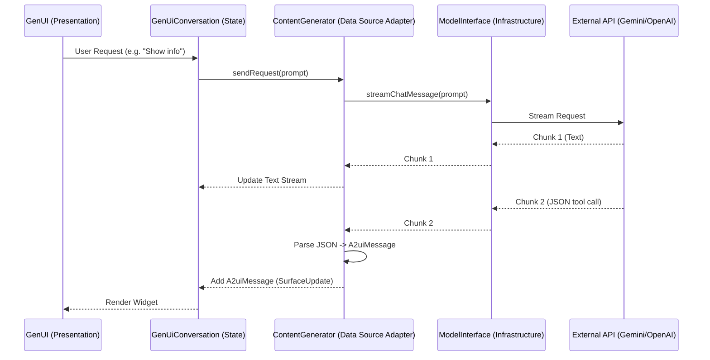

# GenUI Integration Architecture

This document outlines the architectural changes required to integrate GenUI into the application. The design respects the existing Domain-Driven Design (DDD) layered architecture while introducing the necessary reactive components (Streams) for real-time GenUI rendering.

## High-Level Data Flow



## Layer-by-Layer Implementation

### 1. Presentation Layer (UI & State)
**Current:** Uses `Bloc` for standard chat and `GenUiTestPage` uses `GenUiConversation` directly.
**Change:**
*   **The Component**: `GenUiSurface` is the new UI primitive.
*   **The State**: `GenUiConversation` (from the package) acts as the state manager for GenUI flows. It listens to the `ContentGenerator`.
*   **Integration**: We can either embed `GenUiConversation` inside your main Chat Bloc, or (recommended for now) keep the GenUI flow separate in a specialized mode/page until stable, then merge.

### 2. Domain Layer (Business Logic)
**Current:** `SendMessageUseCase` returns a `Future<ChatMessage>`. This effectively blocks until the entire response is ready.
**Gap:** GenUI requires **Streaming**. We need to see partial text and UI updates *while* the AI is still generating.
**Proposed Change:**
*   We need a `StreamSendMessageUseCase` that returns `Stream<ChatMessageChunk>` or similar.
*   *Optimization for GenUI*: The `genui` package *already* defines a domain-like interface: `ContentGenerator`.
    *   `Stream<String> get textResponseStream;`
    *   `Stream<A2uiMessage> get a2uiMessageStream;`
*   **Decision**: We will implement `ContentGenerator` as an adapter in the **Data Layer** that wraps your `ModelInterface`. This keeps the "GenUI logic" encapsulated as an implementation detail of *how* we generate content.

### 3. Data Layer (Repositories & Data Sources)
This is where the heavy lifting happens.

#### A. ModelInterface (Infrastructure)
**Current:**
```dart
Future<String> sendChatMessageModel({...});
```
**New Requirement:**
```dart
Stream<String> streamChatMessageModel({...});
```
*   We must add this method to `ModelInterface` and implement it for Gemini (and eventually OpenAI/others).
*   For Gemini, we will use `gemini.streamChat(...)`.

#### B. ContentGenerator Implementation (Adapter)
We will create `RealGenUiContentGenerator` in `lib/data/datasources/gen_ui_content_generator.dart`.
*   **Role**: It acts as the bridge between the raw LLM stream and the GenUI system.
*   **Logic**:
    1.  Call `_model.streamChatMessageModel()`.
    2.  Listen to the stream.
    3.  If plain text comes in -> push to `textResponseStream`.
    4.  If a special tag or JSON block (e.g. ` ```json ... ``` `) appears -> parse it into an `A2uiMessage` and push to `a2uiMessageStream`.

## Addressing the "Layer vs Feature" Question

> "I want to know what will be changes to domain, what should be done there to create what I need. as I remember I have used usecases and a whole ddd framework for that."

**Recommendation: Stick to Layers (with a twist).**
You have a clean `data/domain/presentation` split. Switching to `features/` now would be a massive refactor (moving files, breaking imports).

However, GenUI is a **Cross-Cutting Concern** that relies on specific *streaming* capabilities that your current `IChatMessageRepository` (Promise-based) doesn't support.

**The Strategy:**
1.  **Don't break the existing `SendMessageUseCase`** used by the main chat yet.
2.  **Add `Stream` capabilities** to the underlying `ModelInterface` (Data Layer) first.
3.  **Build the GenUI integration** as a parallel "path" using the `ContentGenerator` interface (which is effectively a Use Case defined by the package).
4.  **Later**: Once the streaming infrastructure is solid, you can refactor `IChatMessageRepository` to support streaming too, unifying the two paths.

## Summary of Work
1.  **Data**: Update `ModelInterface` to support `Stream<String>`.
2.  **Data**: Implement `streamChat` in `GeminiModelImpl` (using `flutter_gemini`'s stream).
3.  **Data**: Create `GenUiContentGenerator` class that consumes the stream and parses content.
4.  **Presentation**: Wire this generator into the UI.

This approach minimizes risk: your existing chat remains untouched while we build the real-time GenUI capability alongside it.
